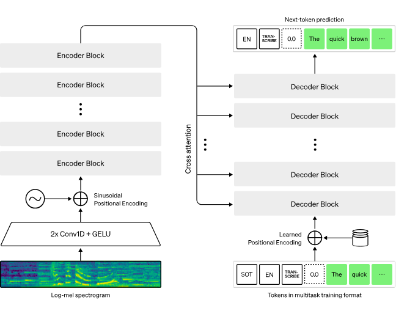
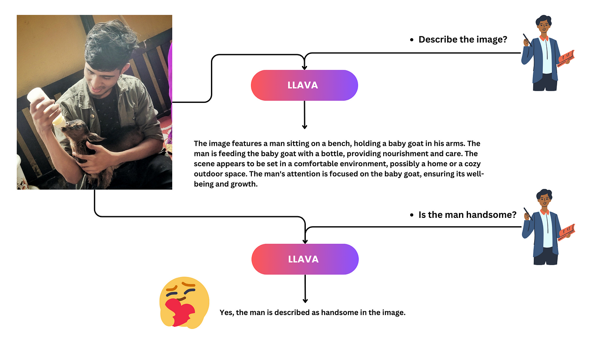
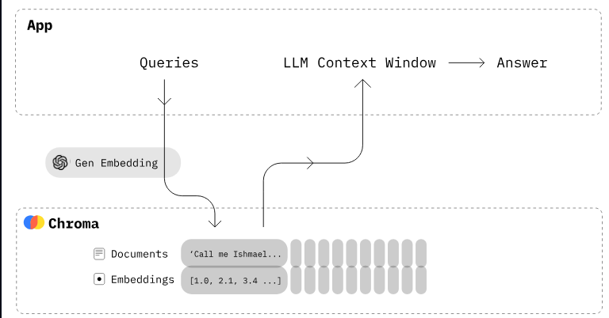
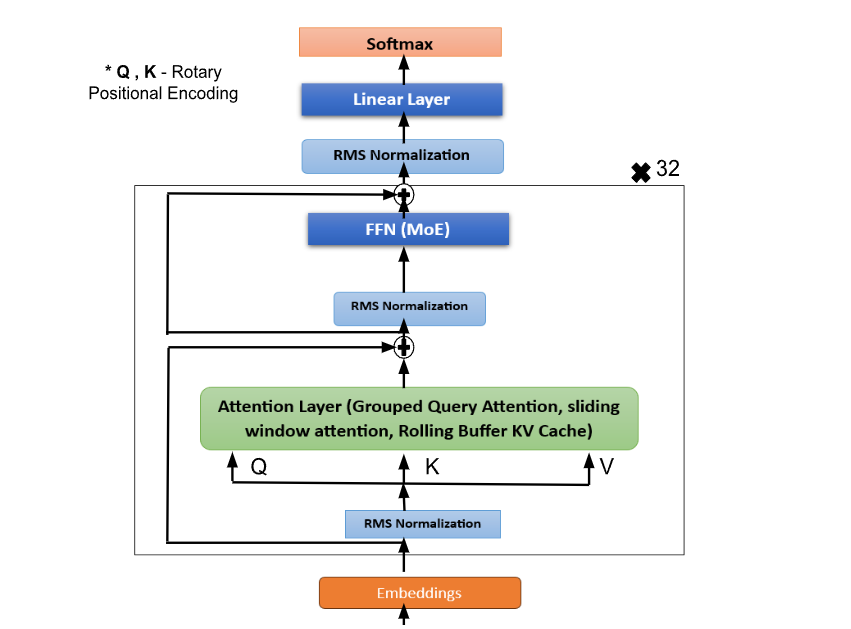
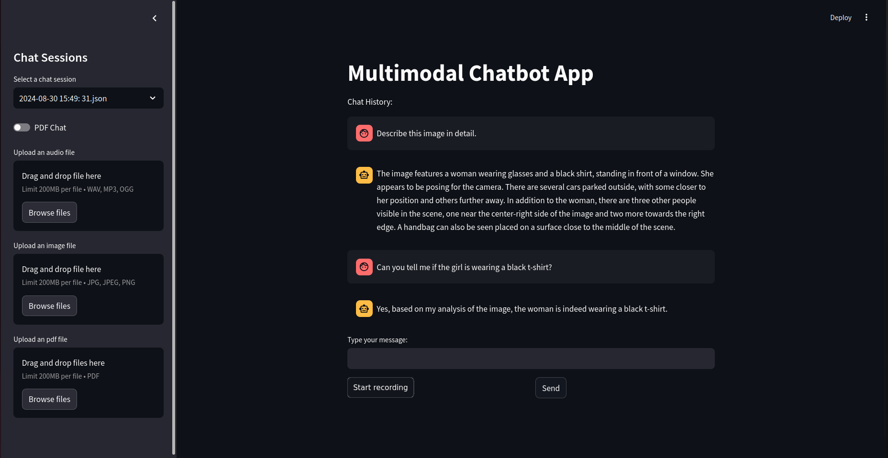

# Multimodal-Chatbot

## Overview

This repository contains a multimodal chatbot designed to handle various types of data, including audio, images, and text-based files like PDFs. The chatbot integrates several state-of-the-art AI models to process and understand different types of input.

## Features
### Audio Processing: 
The chatbot uses the Whisper AI model `mistral-7b-instruct-v0.1.Q3_K_M.gguf` to convert audio into text. This model is a quantized version, which makes it highly efficient for running on standard consumer hardware without significant performance degradation.

[Whisper AI Official Documentation](https://github.com/openai/whisper/blob/main/model-card.md)

### Image Processing: 
For image handling, the chatbot employs the Llava model `llava_ggml-model-q5_k.gguf` and the CLIP model `mmproj-model-f16.gguf`. These models work together to analyze and interpret image content, providing detailed descriptions or answering queries related to the images.

[Llama_cpp Documentation for Llava loading](https://github.com/abetlen/llama-cpp-python/blob/main/README.md)

### PDF Handling and Retrieval-Based Question Answering: 
PDF files are stored in a `Chroma DB`, and the chatbot uses a retrieval-based question-answering approach to interact with these documents. 
The embedding model `bge-large-en-v1.5` is employed for generating embeddings, enabling efficient and accurate retrieval of information from the stored PDFs.

[Chroma DB Official Documentation](https://docs.trychroma.com/)

## Quantized Models

The use of quantized models is a key feature of this chatbot, making it accessible to a broader range of users. Here's why quantized models are beneficial:

- **Efficiency**: Quantized models are optimized to reduce the computational load required for processing. This means they can run efficiently on regular consumer hardware, without needing high-end GPUs or specialized computing resources.

- **Reduced Resource Requirements**: The original versions of these AI models are large and require significant computational power and memory. Quantized models, however, are compressed and require less storage and memory.

- **Maintained Performance**: Despite being smaller, quantized models retain much of the original model's performance. They provide nearly the same accuracy and capabilities while being more lightweight and easier to deploy.

## Mistral 7B
In this particular use-case, `Mistral 7B` was employed for the Audio handling. 

The Mistral 7B model is a powerful language model based on the `Transformer architecture`, designed to perform various natural language processing tasks. With **7 billion parameters**, it can generate and understand text effectively.

### How does Mistral 7B work?
The model processes input by breaking it down into **tokens** and employs a **Sliding Window Attention mechanism** to focus on a few tokens at a time, efficiently handling long text sequences. It consists of **32 Transformer Decoder Layers** that refine its understanding at each layer, improving output accuracy. 
The **Feedforward Layer with SiLU activation** highlights important information, while **RMS Norm** ensures balanced data processing. 
**The Softmax function** converts the model’s understanding into probabilities, enabling it to generate the most likely and coherent response. 
To maintain speed and efficiency, Mistral uses a **Rolling Buffer KV Cache** to remember parts of the input already processed. 

## Getting Started

- Create a Virtual Environment: 
        
    `python3 -m venv chatbot`

- Activate the Virtual Environment:

    `.\chatbot\Scripts\activate` 

- Install Requirements: 
    
    `pip install -r requirements.txt`

- Download Quantized models:
    - For the Audio handling: [Small version: Q3_K_M](https://huggingface.co/TheBloke/Mistral-7B-Instruct-v0.1-GGUF/blob/main/mistral-7b-instruct-v0.1.Q3_K_M.gguf) and [Large version: Q5_K_M](https://huggingface.co/TheBloke/Mistral-7B-Instruct-v0.1-GGUF/blob/main/mistral-7b-instruct-v0.1.Q5_K_M.gguf)
    - For Images handling: [Llava model: GGml model Q5_k](https://huggingface.co/mys/ggml_llava-v1.5-7b/blob/main/ggml-model-q5_k.gguf) and [CLIP Model](https://huggingface.co/mys/ggml_llava-v1.5-7b/blob/main/mmproj-model-f16.gguf)

- Create and place them under `models/` directory for **Audio Quantized models**  and `modals/llava` for **Image Quantized models**.

- Create `pdfs/` and `chat_sessions/` folders.

- Run on the terminal:

    `streamlit run main.py`

## Results
Here is an example of how the chatbot analyzed a provided image, described its content and answered a given question. It also stored this chat history in a session that could be accessed at any desired time.

